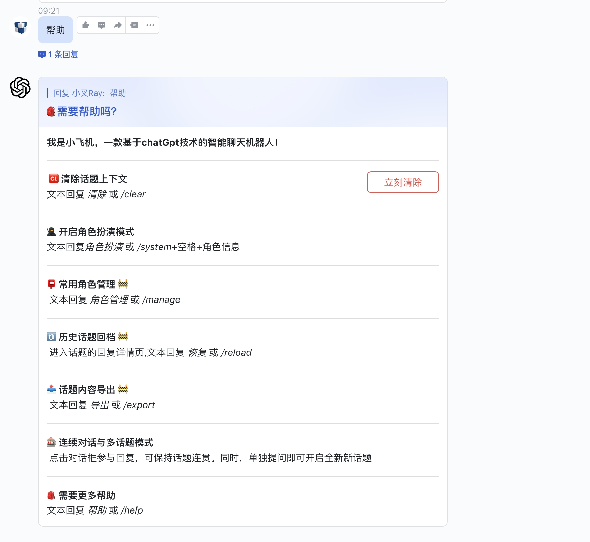

<p align='center'>
    
</p>

<br>

<p align='center'>
    在飞书上与ChatGPT随时对话
<br>
<br>
    Feishu ChatGpt
</p>

## 👻 机器人功能

- 🗣 畅所欲言，直接语音交流 🚧
- 💬 私人和群聊支持多话题同时对话，让讨论更加连贯和高效
- 🔄 持续对话联系上下文，回复对话框即可继续同一话题讨论
- ⏰ 超时自动结束对话，同时支持清除讨论历史
- 📝 支持富文本卡片回复，让信息更加丰富多彩
- 👍 交互式反馈提醒，及时获取机器人处理结果
- 🎭 支持角色扮演的场景模式，为讨论增添乐趣和创意
- 🏞 内置丰富的场景预设，让用户更方便地管理场景  🚧
- 🔙 轻松恢复历史话题，继续讨论  🚧
- 🖼 支持根据文本生成图片，增强信息呈现效果  🚧
- 🔒 内置管理员模式，使用更加安全可靠 🚧


<p align='center'>
    
</p>

## 🌟 项目特点
- 🍏 基于 OpenAI-[gpt-3.5-turbo](https://platform.openai.com/account/api-keys) 接口
- 🍎 通过 lark，将 ChatGPT 接入[飞书](https://open.feishu.cn/app)
- 🥒 支持[Serverless云函数](https://github.com/serverless-devs/serverless-devs)、[本地环境](https://dashboard.cpolar.com/login)、[Docker](https://www.docker.com/) 多种渠道部署
- 🍋 基于[goCache](https://github.com/patrickmn/go-cache)内存键值对缓存


## 项目部署


######  有关飞书具体的配置文件说明，**[➡︎ 点击查看](#详细配置步骤)**


``` bash
git clone git@github.com:Leizhenpeng/feishu-chatGpt.git
cd feishu-chatGpt/code

# 配置config.yaml
mv config.example.yaml config.yaml
```
<details>
    <summary>本地部署</summary>
<br>

如果你的服务器没有公网 IP，可以使用反向代理的方式

飞书的服务器在国内对ngrok的访问速度很慢，所以推荐使用一些国内的反向代理服务商
- [cpolar](https://dashboard.cpolar.com/)
- [natapp](https://natapp.cn/)


```bash
//测试部署
go run main.go
cpolar http 9000

//正式部署
nohup cpolar http 9000 -log=stdout &

//查看服务器状态
https://dashboard.cpolar.com/status

// 下线服务
ps -ef | grep cpolar
kill -9 PID
```

更多详细介绍，参考[飞书上的小计算器: Go机器人来啦](https://www.bilibili.com/video/BV1nW4y1378T/)

<br>

</details>


<details>
    <summary>serverless云函数(阿里云等)部署</summary>
<br>

安装[severless](https://docs.serverless-devs.com/serverless-devs/quick_start)工具
```bash
npm install @serverless-devs/s -g
```
一键部署
``` bash
cd ..
s deploy
```

更多详细介绍，参考[仅需1min，用Serverless部署基于 gin 的飞书机器人](https://www.bilibili.com/video/BV1nW4y1378T/)
<br>

</details>


<details>
    <summary>docker部署</summary>
<br>

``` bash
docker build -t feishu-chatgpt:latest .
docker run -d --name feishu-chatgpt -p 9000:9000 \
--env APP_ID=xxx \
--env APP_SECRET=xxx \
--env APP_VERIFICATION_TOKEN=xxx \
--env OPENAI_KEY=sk-xxx \
feishu-chatgpt:latest
```
------------
小白简易化docker部署版

``` bash
docker地址:https://hub.docker.com/r/w779945/feishu-chatgpt3.5
docker地址: https://hub.docker.com/r/cfxks1989/feishu-chatgpt

docker run -d --restart=always --name feishu-chatgpt2 -p 9500:9000 -v /etc/localtime:/etc/localtim:ro  \
--env APP_ID=xxx \
--env APP_SECRET=xxx \
--env APP_VERIFICATION_TOKEN=xxx \
--env OPENAI_KEY=sk-xxx \
cfxks1989/feishu-chatgpt:latest

最后回调地址是: http://IP:9500/webhook/event

把它填入飞书后台
```
<br>

</details>

## 详细配置步骤

-  获取 [OpenAI](https://platform.openai.com/account/api-keys) 的 KEY
-  创建 [飞书](https://open.feishu.cn/) 机器人
    1. 前往[开发者平台](https://open.feishu.cn/app?lang=zh-CN)创建应用,并获取到 APPID 和 Secret
    2. 前往`应用功能-机器人`, 创建机器人
    3. 从cpolar或者serverless获得公网地址,在飞书机器人后台的 `事件订阅` 板块填写。例如，
        - `http://xxxx.r6.cpolar.top`为cpolar暴露的公网地址
        - `/webhook/event`为统一的应用路由
        - 最终的回调地址为 `http://xxxx.r6.cpolar.top/webhook/event`
    4. 在飞书机器人后台的 `机器人` 板块，填写消息卡片请求网址。例如，
        - `http://xxxx.r6.cpolar.top`为cpolar暴露的公网地址
        - `/webhook/card`为统一的应用路由
        - 最终的消息卡片请求网址为 `http://xxxx.r6.cpolar.top/webhook/card`
    5. 给订阅添加下列回调事件
        - im:message
        - im:message.group_at_msg(获取群组中所有消息)
        - im:message.group_at_msg:readonly(接收群聊中@机器人消息事件)
        - im:message.p2p_msg(获取用户发给机器人的单聊消息)
        - im:message.p2p_msg:readonly(读取用户发给机器人的单聊消息)
        - im:message:send_as_bot(获取用户在群组中@机器人的消息)
        - im:chat:readonly(获取群组信息)
        - im:chat(获取与更新群组信息)
5. 发布版本，等待企业管理员审核通过

更多介绍，参考[飞书上的小计算器: Go机器人来啦](https://www.bilibili.com/video/BV12M41187rV/)


### 更多交流

企业如需定制部署，可联系WeChat: `laolei_forkway`，支持发票~

遇到其他问题，可以加入飞书群沟通~
<p align='center'>
  
</p>
