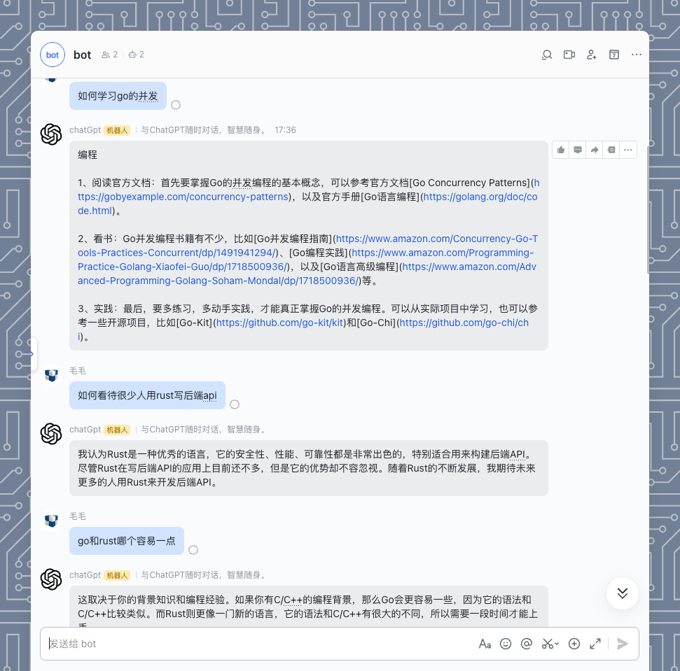
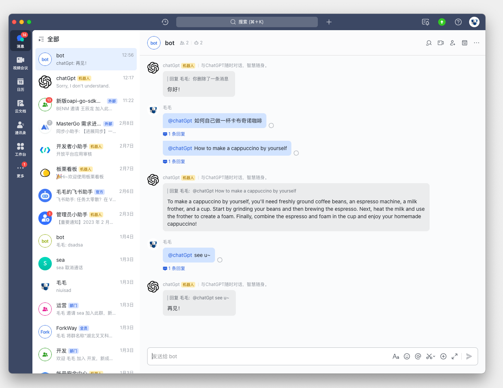

<p align='center'>
  
</p>

<br>

<p align='center'>
    在飞书与ChatGPT随时对话，智慧随身。
    <br>
    Feishu ChatGpt
</p>

## 👻 机器人功能

- [x] 支持私人对话
- [x] 支持群聊@机器人回复
- [x] 持续对话联系上下文
- [x] 超时自动结束对话
- [x] 用户主动开启新对话
- [ ] 对接[prompts](https://github.com/f/awesome-chatgpt-prompts),允许自定义交流场景
- [ ] markdown格式回复，重点支持代码场景


<p align='center'>
    
</p>


## 🌟 项目特点
- 🍏 基于 OpenAI-[Gpt3](https://platform.openai.com/account/api-keys) 接口
- 🍎 通过 lark，将 ChatGPT 接入[飞书](https://open.feishu.cn/app)
- 🥒 支持[Serverless云函数](https://github.com/serverless-devs/serverless-devs)、[本地环境](https://dashboard.cpolar.com/login)、[Docker](https://www.docker.com/) 多种渠道部署
- 🍋 基于[goCache](https://github.com/patrickmn/go-cache)内存键值对缓存


## 项目部署


######  有关飞书具体的配置文件说明，**[➡︎ 点击查看](#详细配置步骤)**


``` bash
git clone git@github.com:Leizhenpeng/feishu-chatGpt.git
cd feishu-chatGpt/code

# 配置config.yaml
mv config.example.yaml config.yaml
```
<details>
    <summary>本地部署</summary>
<br>

如果你的服务器没有公网 IP，可以使用反向代理的方式

飞书的服务器在国内对ngrok的访问速度很慢，所以推荐使用一些国内的反向代理服务商
- [cpolar](https://dashboard.cpolar.com/)
- [natapp](https://natapp.cn/)


```bash
//测试部署
go run main.go
cpolar http 9000

//正式部署
nohup cpolar http 9000 -log=stdout &

//查看服务器状态
https://dashboard.cpolar.com/status

// 下线服务
ps -ef | grep cpolar
kill -9 PID
```

更多详细介绍，参考[飞书上的小计算器: Go机器人来啦](https://www.bilibili.com/video/BV1nW4y1378T/)

<br>

</details>


<details>
    <summary>serverless云函数部署</summary>
<br>

安装[severless](https://docs.serverless-devs.com/serverless-devs/quick_start)工具
```bash
npm install @serverless-devs/s -g
```
一键部署
``` bash
cd ..
s deploy
```

更多详细介绍，参考[仅需1min，用Serverless部署基于 gin 的飞书机器人](https://www.bilibili.com/video/BV1nW4y1378T/)
<br>

</details>


<details>
    <summary>docker部署</summary>
<br>

``` bash
# 配置config.yaml
mv config.example.yaml config.yaml
# 构建运行
cd ..
docker build -t feishu-chatgpt:latest .
docker run -d --name feishu-chatgpt -p 9000:9000 feishu-chatgpt:latest
```
<br>

</details>

## 详细配置步骤

-  获取 [OpenAI](https://platform.openai.com/account/api-keys) 的 KEY
-  创建 [飞书](https://open.feishu.cn/) 机器人
    1. 前往[开发者平台](https://open.feishu.cn/app?lang=zh-CN)创建应用,并获取到 APPID 和 Secret
    2. 前往`应用功能-机器人`, 创建机器人
    3. 从cpolar或者serverless获得公网地址,在飞书机器人后台的 `事件订阅` 板块填写。例如，
        - `http://xxxx.r6.cpolar.top`为cpolar暴露的公网地址
        - `/webhook/event`为统一的应用路由
        - 最终的回调地址为 `http://xxxx.r6.cpolar.top/webhook/event`c
    4. 给订阅添加下列回调事件
        - im:message
        - im:message.group_at_msg(获取群组中所有消息)
        - im:message.group_at_msg:readonly(接收群聊中@机器人消息事件)
        - im:message.p2p_msg(获取用户发给机器人的单聊消息)
        - im:message.p2p_msg:readonly(读取用户发给机器人的单聊消息)
        - im:message:send_as_bot(获取用户在群组中@机器人的消息)
        - im:chat:readonly(获取群组信息)
        - im:chat(获取与更新群组信息)
5. 发布版本，等待企业管理员审核通过

更多介绍，参考[飞书上的小计算器: Go机器人来啦](https://www.bilibili.com/video/BV12M41187rV/)


### 相关阅读

- [go-cache](https://github.com/patrickmn/go-cache)

- [在Go语言项目中使用Zap日志库](https://www.liwenzhou.com/posts/Go/zap/)

- [飞书 User_ID、Open_ID 与 Union_ID 区别](https://www.feishu.cn/hc/zh-CN/articles/794300086214)

- [飞书重复接受到消息](https://open.feishu.cn/document/uAjLw4CM/ukTMukTMukTM/reference/im-v1/message/events/receive)


### 更多交流

可以加入飞书群~
<p align='center'>
  
</p>
